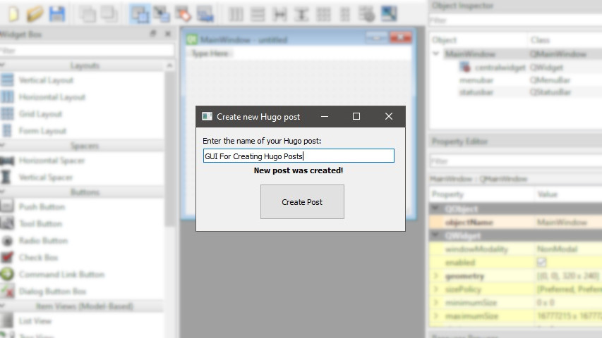

# GUI for Creating Hugo Posts

I feature this script in my blog explaining what it do and how it do it.

https://cesarpazzi.netlify.app/gui-for-creating-hugo-posts/

Basically, it's a GUI for creating new posts instead of launching the command prompt and typing:

`hugo create new post/this-is-my-post/index.md` 

