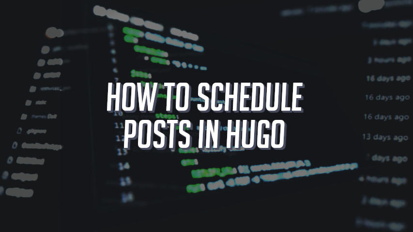

# How To Schedule Posts In Hugo

This is a .yaml file for scheduling Hugo posts when deploying on Netlify.

What it does, it access a Netlify webhook previously set every day at the same time for deploying my blog.

More details on my blog post:

https://cesarpazzi.netlify.app/how-to-schedule-posts-in-hugo-with-screenshots/

